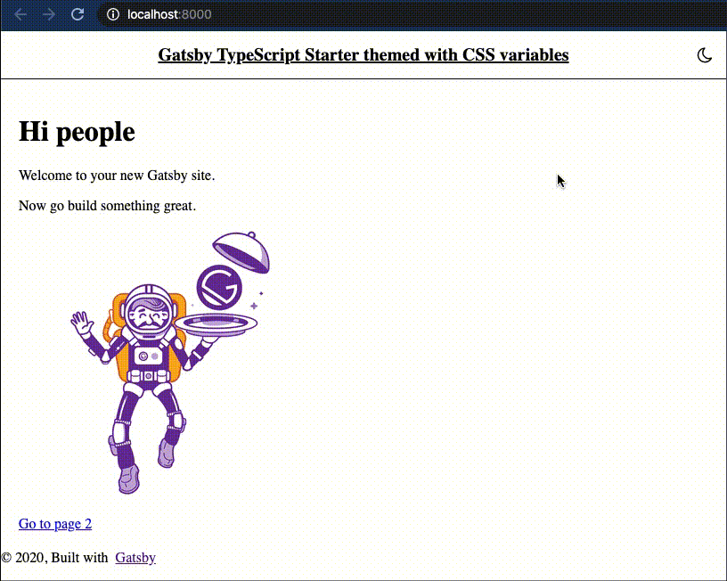

# gatsby-starter-typescript-themes

A Gatsby starter based on the [gatsby-starter-default](https://github.com/gatsbyjs/gatsby-starter-default) with TypeScript support and Light/Dark themes based on CSS variables.

## Includes

* TypeScript
* CSS Modules
* SASS (for both: global styles and CSS Modules)
* Light and Dark themes based on CSS variables.

## Preview



## How to use

1. **Create a Gatsby site.**

    Use the Gatsby CLI to create a new site, specifying the starter.

    ```shell
    # create a new Gatsby site using the starter
    gatsby new my-themed-starter https://github.com/room-js/gatsby-starter-typescript-themes
    ```

1. **Start developing.**

    Navigate into your new site’s directory and start it up.

    ```shell
    cd my-themed-starter/
    gatsby develop
    ```

1. **Open the source code and start editing!**

    Your site is now running at `http://localhost:8000`!

    _Note: You'll also see a second link: _`http://localhost:8000/___graphql`_. This is a tool you can use to experiment with querying your data. Learn more about using this tool in the [Gatsby tutorial](https://www.gatsbyjs.org/tutorial/part-five/#introducing-graphiql)._

    Open the `my-themed-starter` directory in your code editor of choice and edit `src/pages/index.js`. Save your changes and the browser will update in real time!
